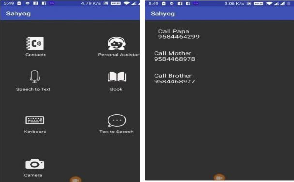
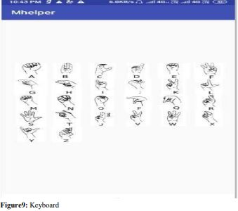

# Jyoti
Jyoti is an idea to convert modern day smart phone to aid people with disabilities like blind, deaf, dumb or any combination of these.
There are two modules
## Hardware
This hard ware can be attacted to the mobile phone and give output of braille letters  
  

## Software
This is on-board android application which has various functionalities to help the disable persons, we will go through one by one : 
  

